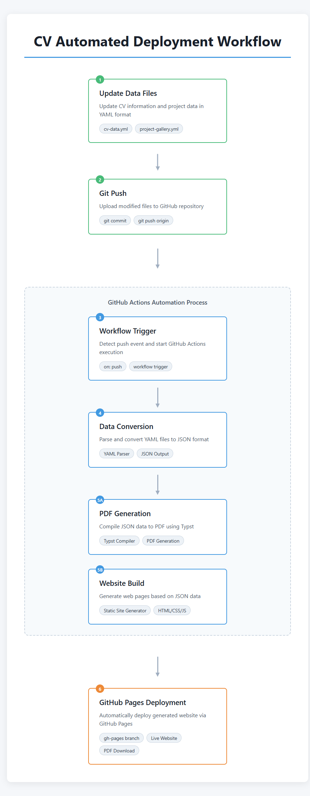

## CV Generator

Live web version: https://kangmg.github.io/CV/  
PDF version: https://github.com/kangmg/CV/blob/gh-pages/data/CV.pdf

### Workflow

The CV is automatically generated from YAML data through a two-stage process:

1. **Data Input**: Edit `cv-data.yml` and `project-gallery.yml` to update content
2. **Build Process**: 
   - Next.js generates the live web version
   - Typst compiles the PDF version from the same data source
3. **Deployment**: GitHub Actions automatically deploys both versions to GitHub Pages

To update your CV, simply modify the YAML files and push changes. Both web and PDF versions will regenerate automatically.
